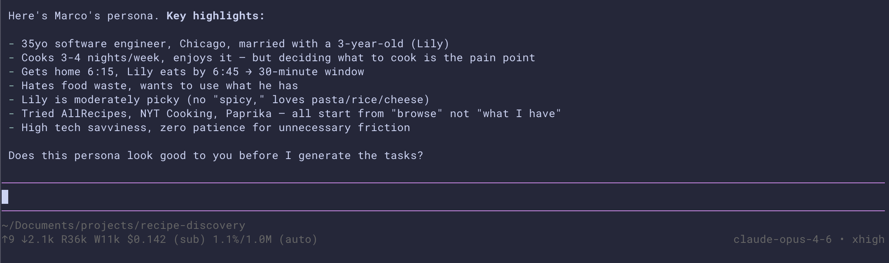
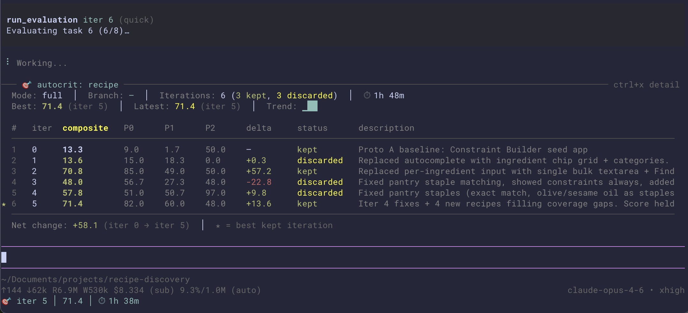
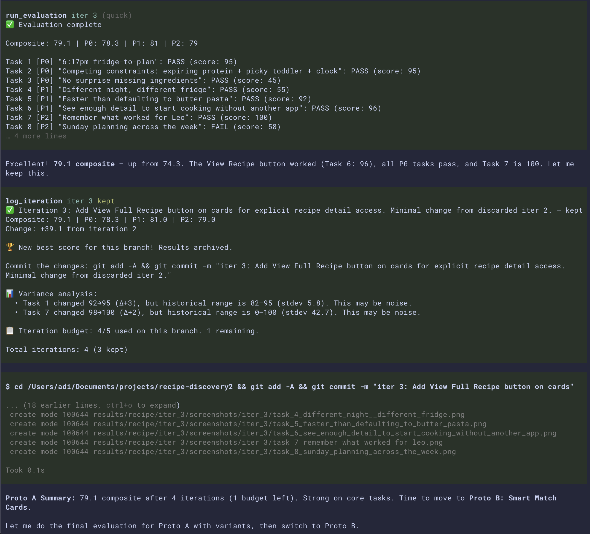
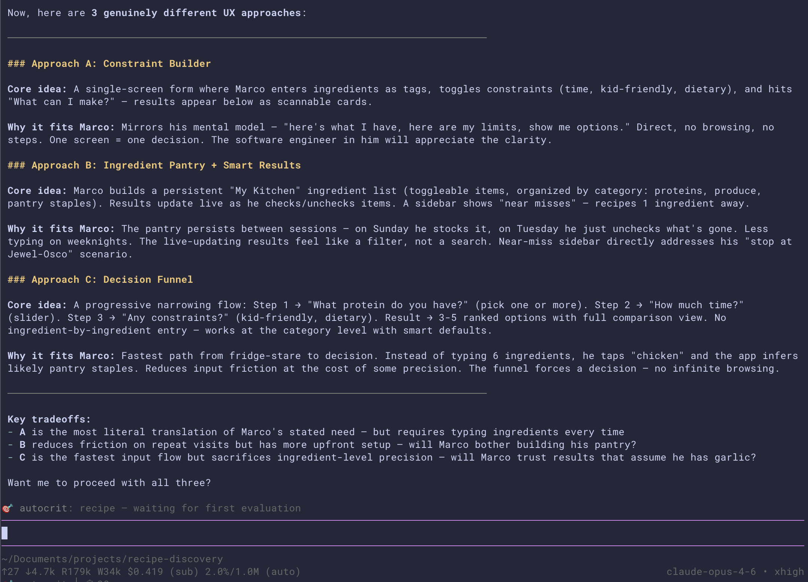

# pi-autoproto

Persona-driven UX evaluation for [pi](https://pi.dev/), inspired by ideas from [autoresearch](https://github.com/karpathy/autoresearch).

For your earliest stages of product development: build a prototype, define your end-user persona, let synthetic users try it, iterate on their feedback, repeat.

## Why

Building software with AI is getting fast and cheap. You can generate a working prototype in minutes. So the bottleneck has shifted from production to evaluation - you can spin up ten prototypes in the time it used to take to build one, but how do you know which one is good? Human evaluation doesn't scale to that pace.

More of the work now is on designing environments, feedback loops, and control systems. Engineers can provide direction, judgment, and taste while the agents do the building. But someone still needs to tell you whether what got built is any good and they need to it fast enough to keep up.

A synthetic persona with a backstory, tasks, and behavioral traits actually uses the app in a real browser and reports what worked, what didn't, and why. The coding agent reads that feedback and iterates. The loop runs autonomously, so in the morning, you have an app that's been through dozens of critique cycles, each one targeted at a specific failure or friction point.

It's early and rough, but it works and I hope it can accelerate prototypes into useful products for humans.

## Quick start

```
pi install https://github.com/adiun/pi-autoproto
```

Then in pi:

```
/skill:autoproto
```

The agent guides you through creating a persona, generating tasks, building a seed app, and starting the evaluation loop. You can close the terminal and come back later — all state is persisted and the agent picks up where it left off.

## Install

```bash
pi install https://github.com/adiun/pi-autoproto
```

<details>
<summary>Manual install</summary>

```bash
cp -r extensions/pi-autoproto ~/.pi/agent/extensions/
cp -r skills/autoproto ~/.pi/agent/skills/
cp -r python ~/.pi/agent/extensions/pi-autoproto/../../python
```

Then `/reload` in pi.

</details>

### Prerequisites

1. [pi](https://pi.dev/) with an LLM configured
2. A browser backend (one of):
   - [agent-browser](https://github.com/vercel-labs/agent-browser): `npm install -g agent-browser && agent-browser install` (default, vision mode)
   - [playwright-cli](https://github.com/microsoft/playwright-cli): `npm install -g @playwright/cli@latest` (text/snapshot mode)
3. [uv](https://docs.astral.sh/uv/): `curl -LsSf https://astral.sh/uv/install.sh | sh`


## Usage

### 1. Create the persona

The coding agent writes the persona's identity (background, environment, agent instructions) but does **not** write the tasks. A separate script calls the persona LLM *as the persona* to generate tasks grounded in their daily life. The builder doesn't define what success looks like — the persona does, from their own context. This adversarial split prevents the agent from writing easy tasks for itself.



That creates `persona.md`:

```markdown
# Persona: Marco Reyes, Software Engineer & Home Cook

## Background

Marco is a 35-year-old software engineer in Chicago, married to Elena, with a
3-year-old son named Leo. On office days he walks through the door at 6:15pm.
Leo needs to eat by 6:45. That 30-minute window is the most stressful part of
Marco's day...

Pain points: (1) The 6:15-6:45 decision paralysis, (2) food waste from
ingredients that go bad, (3) recipe apps that require him to already know what
he wants — browse-first instead of constraint-first...

## Environment

- Device: phone (iPhone, held one-handed while the other hand has the fridge door open)
- Context: standing in the kitchen at 6:15pm, toddler underfoot
- Time pressure: high
- Tech savviness: high, but zero patience for clunky UX when he's in a rush

## Agent Instructions

You are Marco, a 35-year-old software engineer who just got home. It's 6:17pm,
Leo is already asking for snacks. You have no patience right now — if something
takes more than a couple of taps, you'll get frustrated. You think in terms of
"what do I have?" not "what do I want?"

...
```

### 2. The loop

1. The agent edits the app code
2. `run_evaluation` launches the persona in a real browser by clicking, typing, scrolling, getting confused
3. If the score improves, then keep the iteration and commit it. If the score drops, then revert it. This **keep/discard ratchet** lets the agent take creative risks — a failed radical redesign costs one iteration, not the whole project.
4. `log_iteration` records the result, then repeat

### 3. Monitor progress

`Ctrl+X` cycles through compact → expanded → fullscreen dashboard with per-task feedback and variance stats. `/autoproto` shows detailed status.



## What the output looks like



Each evaluation produces per-task scores, stuck points, and verbatim persona feedback. The composite score drives keep/discard decisions. `log_iteration` archives best results, tracks score variance across iterations, and warns when you're running out of iteration budget.

### Verbatim persona feedback

The persona reports back in its own voice, grounded in its daily life:

> *The app handled all three constraints well. I entered my ingredients (leading with broccoli), set ≤30m, toggled Kid-Friendly, and got back 4 makeable recipes. Chicken Broccoli Rice Bowl is perfect: broccoli is front and center, uses the chicken thighs that also need using, 25 minutes fits my window, and every ingredient has a green checkmark — nothing I need to buy.*

> *The parmesan = 4 recipes insight is genuinely actionable — that's my Jewel-Osco stop decided. But the feature is 70% of the way there, not fully solving my 'smart impulse buy on the train' use case.*

This feedback is behavioral, not aesthetic. The persona tells you what it tried to do, what happened, and why it matters in its life context.

### Iteration plans

Before each code change, the agent writes a plan connecting specific persona feedback to specific changes:

```markdown
## Feedback Analysis
- Trust bug: Pantry staple matching uses substring — "pepper" matches
  "bell pepper", "oil" matches "sesame oil". Bell pepper is fresh produce!
- Task 7: Cuisine filter only renders after search. Agent can't find it.
- Task 4: Basil treated as required for Pasta Pomodoro — should be optional.

## Changes Planned
1. Fix pantry staple matching — exact match only.
2. Show cuisine filter before search results.
3. Mark basil, cilantro, green onion as optional garnishes.
```

Every change traces back to something the persona actually struggled with. The plans accumulate into a record of what was tried, what worked, and what was learned.

## Modes

### Quick mode (default)

Single prototype, fast iteration. Good for exploring one UX direction.

### Full mode

Three prototypes with fundamentally different UX approaches, each going through the iteration loop independently. The most important product design questions aren't "should this button be blue or green?" but "should this be a dashboard or a conversational flow?" These can't be answered by iterating on one prototype.



After all prototypes stabilize, `generate_report` produces a comparative analysis: where prototypes agreed, where they diverged, which hypotheses were resolved, and which prototype to take forward.

## An important note

Autoproto is a tool for early-stage exploration and validation, not a replacement for the full product development lifecycle.

A synthetic persona is not a real user. It produces plausible interaction patterns but lacks real prior experience, social context, and emotional variability. The appropriate response to its results is "this gives us confidence to invest deeper in approach A" or "this suggests we should test this model with real users." Not "ship it."

Use it to explore whether an idea has legs, compare fundamentally different UX approaches, surface behavioral friction, and generate structured hypotheses for real user research. Don't use it to skip user research or make final product decisions.

## How it works

The package has two parts: an **extension** (tools, state, UI) and a **skill** (workflow knowledge). Prototype apps are built with [Vite+](https://github.com/nicepkg/vite-plus). The evaluation tools start a dev server automatically and HMR handles code changes between iterations.

### Black-box evaluation

The persona agent runs in a completely separate process (`pi -p`). It has zero access to the coding agent's conversation, the source code, or any context about what was built. It can only see what a real user would see: the running app in a browser. Two browser backends are supported:

- **agent-browser** (default) — annotated screenshots (vision mode). The persona "sees" numbered labels overlaid on interactive elements.
- **playwright-cli** — Playwright's accessibility tree (text mode). Lower token cost, better for modals/overlays.

Via the browser backend, the persona navigates pages, clicks buttons, fills forms, gets confused, tries alternatives, succeeds or fails. Each step produces a reasoning trace.

### Scoring

Tasks are organized by priority tier with a weighted composite:

```
composite = (mean(P0 scores) × 0.60) + (mean(P1 scores) × 0.25) + (mean(P2 scores) × 0.15)
```

If any P0 task scores 0, the composite is capped at 40 — you can't score high by perfecting P2 while core functionality is broken.

Tasks can specify per-task step budgets via `max_steps` in the persona file, so complex tasks that need multi-step data entry aren't artificially constrained by the default limit.

### Exploratory tasks and session wishlist

A fixed task set invites overfitting. In full-mode evaluations, the persona also generates **exploratory tasks** — 2-3 ad-hoc things it wants to try based on what it sees. These are scored separately (not in composite) and surface edge cases the core tasks miss. The coding agent can't game them because it doesn't know what they'll be.

After all tasks, the persona reflects on the whole experience and produces a **session wishlist** — wishes grounded in their daily routine and the friction they hit, plus a "would you actually use this?" honest signal. Both appear in the comparative report.

### Persona variants

Single-run scores are noisy — the same code can score 50 one run and 80 the next. For the final evaluation of each prototype, the system auto-generates four behavioral variants of the persona: the same person in different moods or situations. If your persona is "Marco, tired home cook on a Tuesday night," the variants might be:

- **Rushed Marco** — just walked in, kid is hungry, needs an answer NOW
- **Sunday Marco** — relaxed, willing to browse and explore
- **Skeptical Marco** — doesn't trust the app, double-checks every result
- **Exhausted Marco** — after a double shift, zero patience for anything confusing

Each variant evaluates independently. Where 3 of 4 agree, that's a strong signal. Where they diverge, the app's quality depends on user mood — which is itself a design insight.

When all four variants score >80 with no concrete criticism, the system flags it as **possible sycophancy bias** — a real problem with LLM evaluation that most tools ignore.

### Durability

Several mechanisms protect against data loss and noisy scores:

- **Best result archival.** Best scores are copied to a protected `best/` directory and git-tagged. The comparative report prefers archived results over potentially stale files.
- **Score discrepancy detection.** The report cross-references results files against iteration history and flags when scores diverge due to lost data.
- **Stuck task detection.** Tasks that score 0 across 3+ iterations with step-limit stuck points are flagged as structurally untestable and can be excluded from scoring.
- **Variance tracking.** Per-task score history flags changes within historical stdev as "likely noise" to improve keep/discard decisions.
- **Per-prototype iteration caps.** Warnings at 60% and 100% of budget prevent over-investing in one prototype at the expense of others.
- **Incremental variant writes.** If a variant evaluation crashes partway through, completed variants are preserved.
- **Session resume.** All state is append-only in `autoproto.jsonl`. Close the terminal, come back tomorrow, the agent picks up exactly where it left off.

## The comparative report

In full mode, `generate_report` produces a structured comparison:

| Section | What it shows |
|---------|--------------|
| **Prototype Comparison** | Side-by-side scores with peak scores from iteration history |
| **Verbatim Feedback** | Per-task feedback from each prototype, with fallback to notes and stuck points |
| **Exploratory Tasks** | Ad-hoc tasks the persona invented, their scores, and feedback |
| **Session Wishlist** | Cumulative persona reflections: wishes, surprises, and "would I use this?" |
| **Why Others Didn't Win** | Task-level analysis of where each losing prototype fell short |
| **Recommendations** | Strongest prototype (using best available score), bias flags for validation |

## How autoproto compares

### vs. traditional user testing

Recruiting participants, scheduling sessions, synthesizing notes.

- **Speed:** Overnight autonomous runs vs. weeks of recruiting and scheduling
- **Cost:** LLM tokens vs. user incentives and researcher time
- **Repeatability:** Versioned, comparable across iterations vs. qualitative and one-shot
- **Tradeoff:** Synthetic behavior — plausible but not real human judgment. Autoproto generates hypotheses for user research, not conclusions that replace it.

### vs. screenshot-based UI evaluation

Showing an LLM a screenshot and asking it to rate the design.

- **Interaction:** Real browser sessions (click, fill, scroll, get confused, try alternatives) vs. static image assessment
- **Signal type:** Behavioral data (steps taken, where stuck, what paths tried) vs. aesthetic ratings ("the layout is clean")
- **Failure modes:** The persona gives up, gets lost, misreads a label — the same things real users do. A screenshot judge only sees what's on screen, not what happens when you use it.

### vs. automated testing (Cypress, Playwright)

Functional test suites that assert correctness.

- **What's tested:** UX quality and decision support vs. functional correctness
- **Task type:** Judgment-based ("what would you cancel?") vs. assertion-based (`expect(button).toBeVisible()`)
- **Feedback:** Qualitative and grounded in a persona's life context vs. pass/fail with stack traces

### vs. A/B testing

Splitting production traffic between variants and measuring conversion.

- **Timing:** Pre-production (tests prototypes before building the real thing) vs. post-ship (requires production traffic)
- **Scope:** Compares fundamentally different UX approaches vs. incremental variations (button colors, copy changes)
- **Infrastructure:** Runs on a dev machine vs. requires production deployment and traffic volume

### vs. LLM-as-judge (direct scoring)

Asking an LLM to score an app description, spec, or screenshot directly.

- **Evidence basis:** The persona actually uses the app in a browser vs. rating a description or image
- **Transparency:** Full interaction traces — you can see exactly what happened at every step vs. a single score with rationale
- **Output richness:** Scores + per-task feedback + stuck points + session wishlist vs. a number and a paragraph

## Cost and performance

Cost and time scale with number of tasks, steps per task, and iterations.

| Configuration | Token cost | Wall-clock time |
|---|---|---|
| Quick mode, 8 tasks | ~$2–5 | 10–20 min |
| Full mode, 8 tasks | ~$5–10 | 20–40 min |
| Variant evaluation, 8 tasks × 4 variants | ~$15–25 | 60–120 min |
| Full session (3 prototypes, 5 iters each, final variants) | ~$80–150 | 6–10 hours |

Costs depend on model, provider pricing, and vision vs. text mode. To manage: start with quick mode and fewer tasks, use a cheaper model for the persona agent (it navigates and clicks — it doesn't need the most capable model), use text mode for lower token cost, and save full mode with variants for when the persona and tasks are dialed in.

## License

MIT
